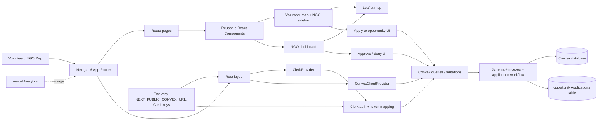
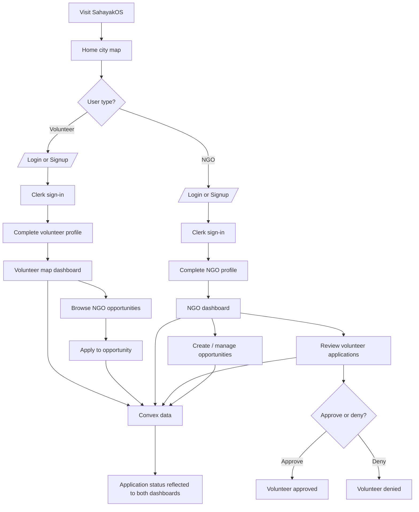

# SahayakOS

A volunteer coordination platform that connects NGOs with qualified volunteers for crisis response and community service.

## Overview

- Volunteer signup, login, password reset, and profile completion
- NGO signup, login, profile management, and dashboard flows
- A city-based volunteer map on the home page
- An NGO opportunity map with city, skill, and urgency filters
- Volunteer-to-opportunity applications with NGO approval/denial workflow
- Convex-backed data models for volunteers, NGOs, accounts, and opportunities
- Clerk authentication synced with Convex session data

## Tech Stack

- **Frontend**: [Next.js](https://nextjs.org) 16.2+ with React 19, TypeScript
- **Styling**: [Tailwind CSS](https://tailwindcss.com) 4 + [shadcn](https://shadcn.com) components
- **Backend**: [Convex](https://convex.dev) (serverless backend as a service)
- **Authentication**: [Clerk](https://clerk.com)
- **Maps**: [Leaflet](https://leafletjs.com) for interactive map visualization
- **UI Components**: Base UI, Lucide icons, CVA for component variants

## Architecture



## Key Routes

- `/` - Home city map dashboard
- `/login` - Volunteer login
- `/signup` - Volunteer signup
- `/profile` - Volunteer profile setup
- `/pwreset` - Password reset flow
- `/sso-callback` - Clerk redirect callback
- `/opportunities` - NGO opportunity map
- `/ngo` - NGO dashboard
- `/ngo/login` - NGO login
- `/ngo/signup` - NGO signup
- `/ngo/profile` - NGO profile setup

## Application Flow



## Quick Start

### Prerequisites

- Node.js 18+ (or Bun)
- npm or bun package manager

### Installation

1. Clone the repository:
```bash
git clone <repository-url>
cd ps1
```

2. Install dependencies:
```bash
npm install
# or with bun
bun install
```

3. Set up environment variables in `.env.local`:

- `NEXT_PUBLIC_CONVEX_URL` - Your Convex deployment URL
- `NEXT_PUBLIC_CLERK_PUBLISHABLE_KEY` - Clerk public key
- `CLERK_SECRET_KEY` - Clerk secret key
- `CLERK_FRONTEND_API_URL` - Clerk issuer domain for Convex auth
- `NEXT_PUBLIC_CITY_MAPS` - JSON array of city map configurations

### Development

Run the development server:

```bash
npm run dev
# or
bun dev
```

Open [http://localhost:3000](http://localhost:3000) in your browser.

The app will auto-reload as you make changes.

## Available Scripts

- `npm run dev` - Start development server
- `npm run build` - Build for production
- `npm start` - Run production build
- `npm run lint` - Run ESLint
- `npm run typecheck` - Validate TypeScript and generate route types

## Project Structure

```
├── app/
│   ├── layout.tsx
│   ├── page.tsx
│   ├── login/page.tsx
│   ├── signup/page.tsx
│   ├── profile/page.tsx
│   ├── pwreset/page.tsx
│   ├── sso-callback/page.tsx
│   ├── opportunities/page.tsx
│   └── ngo/
│       ├── page.tsx
│       ├── login/page.tsx
│       ├── signup/page.tsx
│       └── profile/page.tsx
├── components/
│   ├── city-map-dashboard.tsx
│   ├── city-map.tsx
│   ├── ngo-dashboard.tsx
│   ├── ngo-opportunity-map.tsx
│   ├── ngo-profile-form.tsx
│   ├── ngo-signup-form.tsx
│   ├── signup-form.tsx
│   ├── login-form.tsx
│   ├── pwreset-form.tsx
│   ├── availability-selector.tsx
│   └── ui/
├── convex/
│   ├── schema.ts
│   ├── auth.config.ts
│   ├── queries.ts
│   ├── mutations.ts
│   ├── volunteers.ts
│   ├── volunteerAccounts.ts
│   └── http.ts
├── lib/
│   ├── city-maps.ts
│   ├── clerk-convex-auth.ts
│   ├── form-options.ts
│   ├── utils.ts
│   └── volunteer-session.ts
├── public/
└── [config files]
```

## Data Model

- **volunteers**: profile, contact details, skills, languages, availability, devices, and reliability fields
- **volunteerAccounts**: Clerk-to-Convex account mapping for signed-in volunteers
- **ngos**: organization details, headquarters, coverage areas, and ownership metadata
- **opportunities**: NGO-created opportunities with urgency, skills, time window, and status
- **opportunityApplications**: volunteer applications to opportunities with pending/approved/denied review states

## Authentication Flow

The application uses Clerk for authentication with separate flows for volunteers and NGO representatives. Clerk sessions are synchronized with Convex so saved profiles and dashboards can load the right data for each signed-in user.

## Development Workflow

- `npm run typecheck` validates TypeScript and generates route types.
- `npm run lint` checks code quality.
- `convex/schema.ts` defines the backend schema and indexes used by the app.

## Deployment

### Vercel (Recommended)

1. Push your code to GitHub
2. Import the repository in [Vercel](https://vercel.com)
3. Configure environment variables
4. Deploy

## Contributing

1. Create a feature branch (`git checkout -b feature/your-feature`)
2. Make your changes and test locally
3. Run linting and type checking
4. Commit and push to GitHub
5. Create a pull request

## Support & Documentation

- [Next.js Documentation](https://nextjs.org/docs)
- [Convex Documentation](https://convex.dev/docs)
- [Clerk Authentication Guide](https://clerk.com/docs)
- [Tailwind CSS Docs](https://tailwindcss.com/docs)

## License

No license has been specified yet.

## Acknowledgments

Built for the Google Solutions Challenge to support crisis response and community volunteerism.
